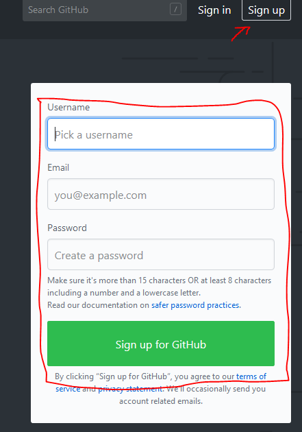
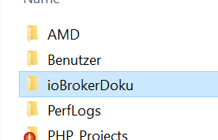
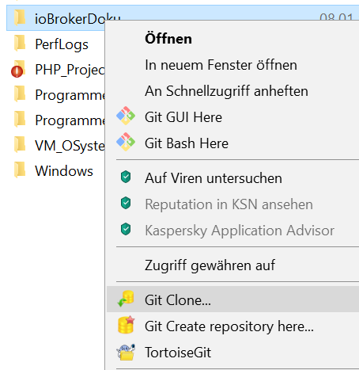
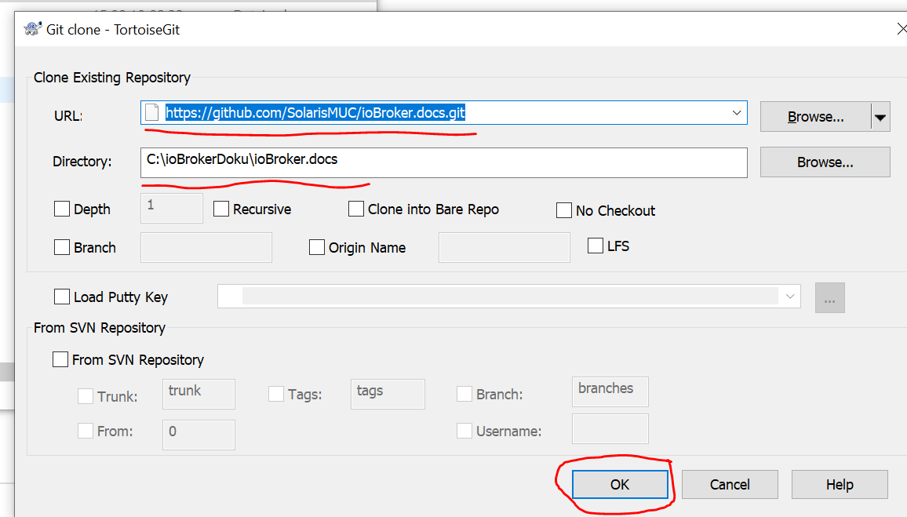
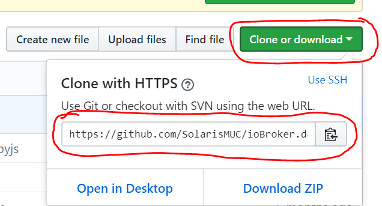
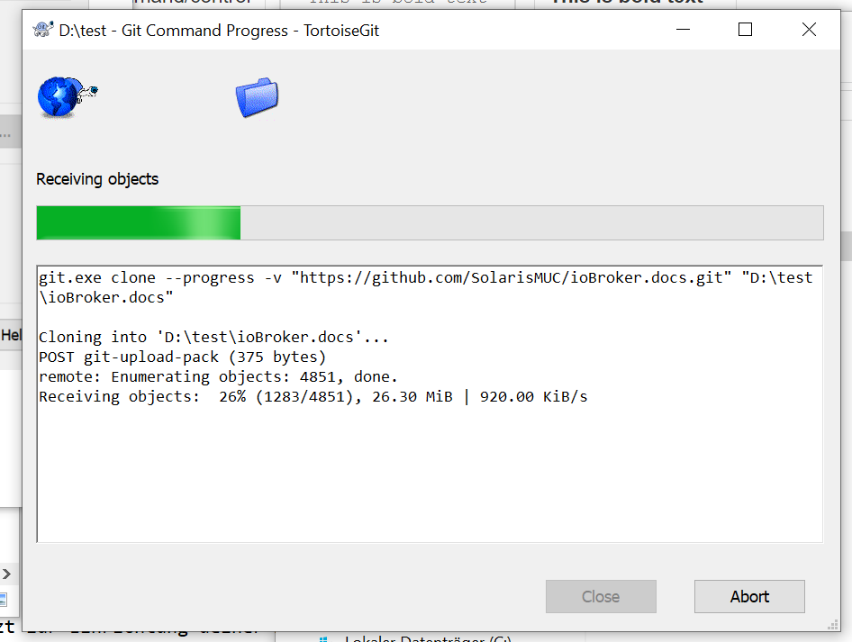

---
title:       "Entwicklung - Dokumentation"
lastChanged: "08.01.2019"
editLink:    "https://github.com/ioBroker/ioBroker.docs/edit/master/docs/community/doc.md"
---

Mithilfe bei der Erstellung der Dokumentation {docsify-ignore-all}

================================================================

Einleitung
---------

Du möchtest uns bei der Erstellung der ioBroker-Dokumentation aktiv unterstützen?
Dann findest du in den folgenden Abschnitten alles nötige um relativ schnell und ohne Umwege,
damit zu starten.

### 1. Erste Schritte

- Melde dich im ioBroker Forum unter folgendem Thema: [Dokumentationshilfe](https://forum.iobroker.net/viewtopic.php?f=8&t=16933&p=216031#p216031 "Anmelden als DokumentsMan") 

### 2. Welche Dinge werden benötigt

- Github Account  -> zu finden hier. Du hast noch keinen? Dann kannst du [hier](https://github.com/ "Github Account anlegen") einen anlegen
- TortoiseGIT     -> für dein Betriebssystem, findest du [hier](https://tortoisegit.org/ "TortoiseGIT download") 
- Git             -> für dein Betriebssystem, findest du findest du [hier](https://git-scm.com/ "GIT download")

### 2.1. Der Github Account

In diesem Abschnitt wird dier erklärt wie du einen GitHub Account anlegst und nachfolgend einen "Fork"
der ioBroker.docs in selbigen realisierst.

#### 2.1.1 Wie erstelle ich einen neuen Account

Sobald du die Github website aufgerufen bite rechts oben auf SignIn klicken und das sich öffnende Fenster einmal komplett
ausfüllen.(siehe Abbildung). Danach mit dem Button "Sign up for GitHub" bestätigen.  

 

Jetzt bekommst du eine E-Mail an die von dir angegebene E-Mail Adresse, in dieser ist ein Link zur bestätigung selbiger vorhanden,
diesen bitte einmal anklicken. Danach ist deine E-Mail bestätigt und du kannst deinen GitHub Account kostenlos nutzen.

#### 2.1.2 Wie bekomme ich eine Kopie der Dokumentation in meinen Account und was zum Teufel ist ein Fork

Vorab eine kleine Erklärung zu den Begriffen die dir wärend der Arbeit mit GIT immer wieder begegnen werden:

<b>Fork</b>

Ein Fork ist quasi eine Kopie eines bestehenden Projektes. In diesem Fall des ioBroker.docs, also dem Dokumentationsprojektes. 
Dies wird hauptsächlich aus den folgenden Gründen gemacht:           
- Du möchtest etwas für dich ändern, aber nicht von vorne anfangen.                                    
- Du möchtest etwas zu einem Projekt beisteuern 

Dabei ist die grundsätzliche Idee, dass du ein paar Modifikationen an einem Projekt machen möchtest.   
Das schöne dabei ist, dass du Änderungen die nach dem Fork am Ursprungsprojekt gemacht wurden in dein geändertes Projekt integrieren kann. In deinem Fork hast du allerdings die Kontrolle wann du was machen möchtest.         
Wenn du zu einem bestehenden Projekt etwas beisteuern möchtest, dann erstellst du einen Fork eigentlich nur um diese Änderung zu machen und dann in das Ursprungsprojekt zurück zuführen.
Wichtig ist, dass du die Zusammenhänge zwischen den Verzeichnissen <b>lokal</b>, <b>origin</b> und <b>upstream</b> verstehst.

<b>Issue</b>

Auf GitHub werden Issues für ziemlich viel benutzt. Es ist der Mechanismus um mit den Entwicklern eines Projektes in Kontakt zu treten. Dabei kannst du grundsätzlich ein Issue verwenden um:
- eine Frage zu stellen
- ein Problem zu berichten
- einen Fehler zu berichten
- ein ToDo anzulegen

Du solltest allerdings bedenken, dass ein Issue immer Arbeit für die Entwickler/Dokumentatoren bedeutet. 
Im Fall des ioBroker.docs Projektes werden Issues meist für das Erstellen von Dokumentationsaufgaben verwendet

<b>Pull Request</b>

Öffentliche Projekte auf GitHub sind üblicherweise so aufgebaut, dass es einen oder ein Team von Entwicklern gibt und diese können Änderung an dem Projekt vornehmen. Um nun aber der gesamten Community die Möglichkeit zu geben einen Beitrag zu machen, wurden Pull Requests eingeführt.

Dabei handelt es sich letztlich nur um eine Mail, in der jemand aus der Community darum bittet seine Änderungen in das vom Entwickler gepflegte Git-Verzeichnis zu integrieren. Über diesen "Umweg" wird sichergestellt, dass der verantwortliche Entwickler bzw. das Team die letzte Entscheidung über Änderungen hat.

<b>Branches</b>

Bei Branches handelt es sich grob gesprochen um eine Arbeitskopie des "master", welche erzeugt wird um in unserem Fall, z.b. an einer bestimmten Dokumentation zu arbeiten ohne die Hauptlinie den "master" eines Projektes zu verändern.

Wir empfehlen dir z.B. für jeden Dokumentationsteil den die bearbeitest in deinem Projekt einen eigenen "Branch" zu erstellen, 
und nur in diesem an der dazugehörigen Dokumentation zu arbeiten. Sobald du die Dokumentation finalisiert hast, kannst du den "Branch" wieder dem "master" über den "Merge" Befehl zuführen.
So wird sichergestellt das der "master" immer ein lauffähiges Extrakt bereitstellen kann.

<b>local</b>

Als "local" wird deine lokale, auf deinem Computer vorhandene Arbeitskopie des GIT-Projektes bezeichnet. Dabei gilt zu verstehen,
wie GIT funktioniert:
- GIT ist ein 2-Wege-System, es gibt eine serverseitige Version des Projektes (z.B. auf GitHub) und eine clientseitige Version auf deinem lokalen System.

Wenn du auf deinem System arbeitest, so werden alle Änderungen zu allererst "local" also an der clientseitigen Version deines Projektes
gemacht, diese Änderungen "commitest" du zu allererst in die "local" Version.
Das heist die serverseitige Version bleibt davon unberührt, erst wenn du einen sogenannten <b>"push to upstream"</b> machst werden diese Änderungen auf die serverseitige Version geschrieben.

Befehle zum speichern im "local" Repository in der GIT-Shell wären:
> <em>git commit

> <em> git commit -m (message)

> <em> git commit -a

<b>origin</b>

Als "origin" wird das Remote-Repository (z.b. auf GitHub ) deines Projektes bezeichnet, wobei "origin" hierbei einen Alias darstellt welcher auf die URL des Repositories zeigt.
mit dem Befehl in der GIT-Konsole:
> <em>git remote -v

Kannst du dir zum beispiel alle Aliases und deren URL auf die sie verweisen anzeigen lassen.

<b>downstream</b>

Als "downstream" wird der Prozess clone, checkout, etc. bezeichnet, sprich wenn du ein Projekt von z.B. GitHub auf dein lokales System
kopierst, benutzt du meist in der GIT-Shell:

> <em>git clone (URL des serverseitigen Repository) (Pfad zum lokalen Ordner deines Systems)

Auch ein "checkout" ist so ein "downstream" allerdings setzt dies ein bestehendes "locales" Repository des Projektes voraus.
Hierzu kannst du in der GIT-Shell folgende Befehle nutzen:

> <em>git checkout</em> [-q] [-f] [-m] [&lt;branch&gt;]

> <em>git checkout</em> [-q] [-f] [-m] --detach [&lt;branch&gt;]

> <em>git checkout</em> [-q] [-f] [-m] [--detach] &lt;commit&gt;

> <em>git checkout</em> [-q] [-f] [-m] [[-b|-B|--orphan] &lt;new_branch&gt;] [&lt;start_point&gt;]

> <em>git checkout</em> [-f|--ours|--theirs|-m|--conflict=&lt;style&gt;] [&lt;tree-ish&gt;] [--] &lt;paths&gt;&#8230;&#8203;

> <em>git checkout</em> [&lt;tree-ish&gt;] [--] &lt;pathspec&gt;&#8230;&#8203;

> <em>git checkout</em> (-p|--patch) [&lt;tree-ish&gt;] [--] [&lt;paths&gt;&#8230;&#8203;]

<b>upstream</b>

So nach der trockenen Theorie kommen wir jetzt zur Einrichtung deiner Arbeitsumgebung auf deinem lokalen System.
An dieser Stelle sollte jetzt folgende Software bei dir installiert sein:

- GIT
- TortoiseGit
- Irgend ein Editor wie z.B. Word, oder aber auch eine IDE wie Visual Studio Code, Netbeans etc.

<b>Step 1.</b>

Erstelle in auf deinem FileSystem einen neuen Ordner: zb. GIT_ioBroker (siehe Bild unten)

<b>Step 2.</b>

- Rechtsklick auf den von dir erstellten Ordner, im erscheinenden Kontextmenü den Punkt "Git Clone" auswählen

- in dem sich jetzt öffnenden Fenster unter "URL" den weblink zu deinem Git-Repository reinschreiben/Kopieren 
  (siehe Abb. 01).
- diesen findest du wenn du in deinem Github-Account das von dir erstellte Repository anklickst, auf der rechten Seite 
  (siehe Abb. 02).

*Abb. 01*

*Abb. 02*
- nachdem du die Eingaben bestätigt hast beginnt der "Clone" - Vorgang des Repository in den Ordner, 
  welchen du auf deinem lokalen System angegeben hast (siehe Abb. 03). Dies kann je nach Grösse des Repository und der Geschwindigkeit
  deiner Internetleitung eine bestimmte Zeit dauern. Hol dir am besten eine Kaffee ;)

*Abb. 03*